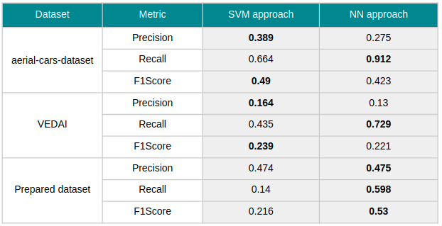

aerial-images-cars-detection
==============================

This project is an assingment for Computer Vision course at Wroclaw Univ. of Science and Technology. 

Main project goal was cars detection in aerial images using sliding window and two different approaches for classification:
- image descriptors (Histogram of Oriented Gradients, Local Binary Patterns) and SVM classifiers,
- image preprocessing (normalization, histogram equalization, Gaussian blur) and pretrained convolutional neural network classifier (transfer learning on ResNet18 and ResNet50).

Additionally projest goal was to test idea for parkings detection based on detected cars clustering and comaprising clusters in the same area photos from different time.

Datasets
------------
- [aerial-cars-dataset](https://github.com/jekhor/aerial-cars-dataset)
- [VEDAI](https://downloads.greyc.fr/vedai/) (named *vehicules* in the project)
- small dataset to test detection knowledge generalization and test parking detection method prepared by project authors based on orthophotomap of Wroclaw city (named *orto* and *orto_parkings* in the project)

Outcome
------------
Table below presents best cars detection results gained among all experiments. For dataset prepared by authors models trained on aerial-cars-dataset have been used.

Most interesting outcome is neural network good knowledge generalization on prepared dataset. Images below shows sample results of detections on this dataset:

Full report covers all experiments and conclusions is available [here](https://github.com/kornelro/aerial-images-cars-detection/blob/master/assets/AOiW.pdf) (polish language only). 

--------

<small>Project based on the <a target="_blank" href="https://drivendata.github.io/cookiecutter-data-science/">cookiecutter data science project template</a>. #cookiecutterdatascience</small>

